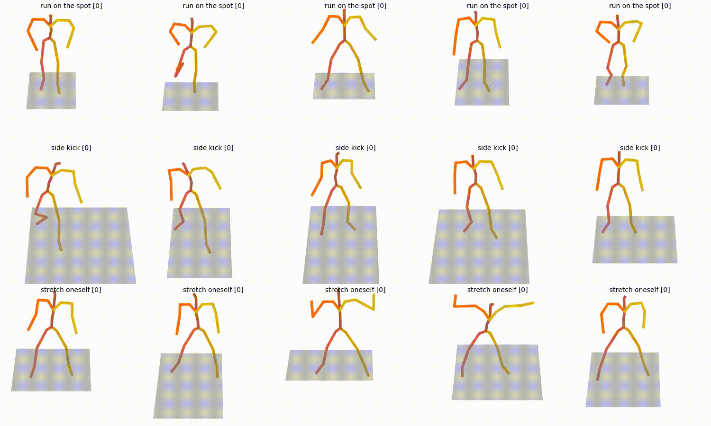
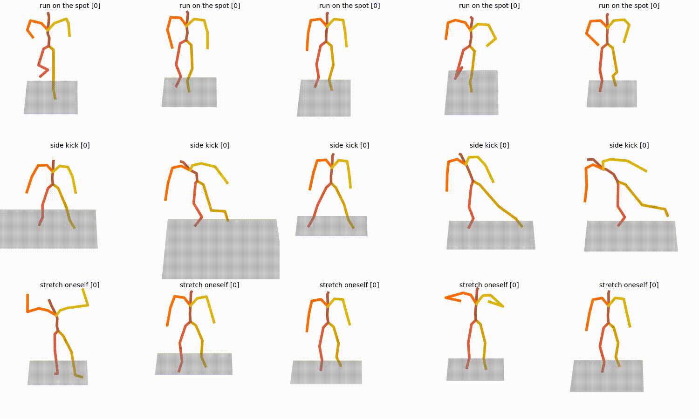

<div align="center">

<h1>KineMIC</h1>
<h3><em>Kinetic Mining in Context: Few-Shot Action Synthesis via Text-to-Motion Distillation</em></h3>

<br>

[](https://arxiv.org/abs/2512.11654)
[](https://lucazzola.github.io/kinemic-page/)
[](https://arxiv.org/abs/2512.11654)

<br>

*Official implementation — ICPR 2026 main conference proceedings*

</div>

---

**KineMIC** adapts a pre-trained Text-to-Motion diffusion model into a specialized **Action-to-Motion generator** for Human Activity Recognition (HAR), using as few as **10 real samples per class**. It leverages CLIP semantic correspondences to mine kinematically relevant motion from a large source dataset, guiding fine-tuning of the generalist backbone via contrastive distillation and LoRA adaptation.

> For method details, results, and animated examples → [project page](https://lucazzola.github.io/kinemic-page/) · [paper](https://arxiv.org/abs/2512.11654)

<br>

## Visual Comparison

<div align="center">

| MDM (baseline) | KineMIC (ours) |
|:-:|:-:|
|  |  |

</div>

<br>

## Repository Structure

```
KineMIC/
├── external/
│   ├── motion-diffusion-model/   # adapted MDM — training & sampling scripts
│   └── pyskl/                    # ST-GCN evaluator for downstream HAR
├── scripts/                      # data preprocessing & few-shot split tools
├── data/                         # datasets (NTU60, NTU120, HumanML3D, ...)
├── prep/                         # setup shell scripts
└── docs/
    ├── setup.md                  # environment & data setup
    ├── train.md                  # training reference
    ├── sample.md                 # sampling reference
    └── other.md                  # misc utilities & tools
```

<br>

## Getting Started

<div align="center">

| Step | Guide | Description |
|:---:|:---|:---|
| 1 | [**Setup**](docs/setup.md) | Environment, dependencies, data download |
| 2 | [**Training**](docs/train.md) | MDM baseline, KineMIC, ST-GCN evaluator |
| 3 | [**Sampling**](docs/sample.md) | Motion synthesis, synthetic dataset generation |
| — | [**Other**](docs/other.md) | Few-shot split tools, ST-GCN evaluator, misc utilities |

</div>

<br>

## Citation

If you find this work useful, please cite:

```bibtex
@misc{cazzola2026kineticminingcontextfewshot,
      title={Kinetic Mining in Context: Few-Shot Action Synthesis via Text-to-Motion Distillation}, 
      author={Luca Cazzola and Ahed Alboody},
      year={2026},
      eprint={2512.11654},
      archivePrefix={arXiv},
      primaryClass={cs.CV},
      url={https://arxiv.org/abs/2512.11654}, 
}
```
